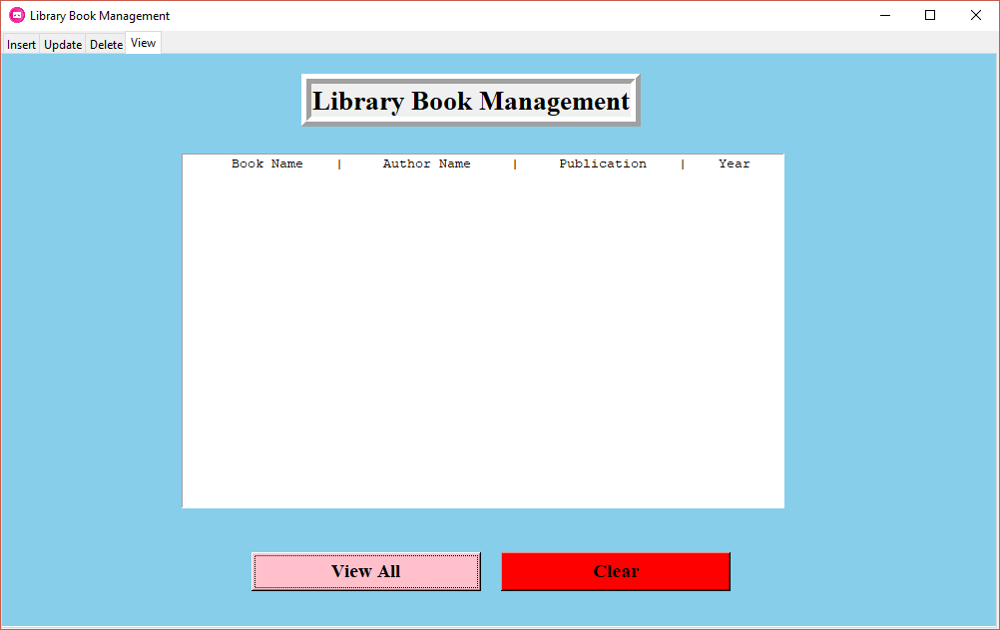

# Library Book Management System

Add, Update, Delete And View Book Details like Book Name, Author Name, Publication and Year of Publication in #MySQL database by using #tkinter.

## Prerequisite 
### Modules/Packages

- mysql.connector
- tkinter
- tkinter.messagebox

### MySQL
- Create Database
	Craete database name as `Books`
- Create Table
	Create table with name as `Book Details` and descripton of table with this query `'create table if not exists Book_Details(Book_Name varchar(255) primary key,Author_Name varchar(50),Publication varchar(50),Year integer(10))`

## Images
### Insert Before

### Insert After

### Update Before

### Update After

### Delete Before

### Delete After

### View Before

### View After

